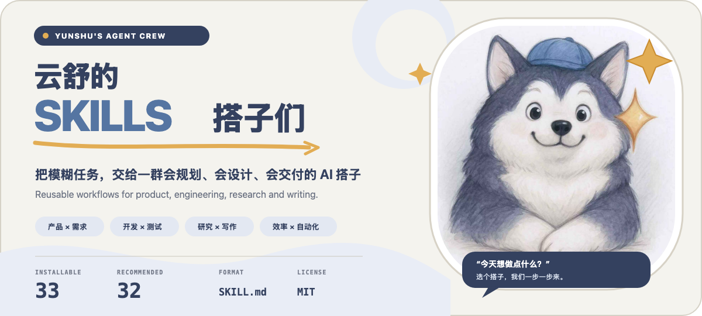

<p align="right">
  <a href="./README.md">简体中文</a> · <strong>English</strong>
</p>

<p align="center">
  
</p>

# Yunshu SkillsHub

Turn fuzzy requests into reusable, executable, and verifiable AI workflows.

<p align="center">
  <a href="https://github.com/yunshu0909/yunshu_skillshub/stargazers"></a>
  <a href="https://github.com/yunshu0909/yunshu_skillshub/network/members"></a>
  <a href="./LICENSE"></a>
  
</p>

This is not a pile of disconnected prompts. Each Skill uses `SKILL.md` to preserve its triggers, stages, decision gates, constraints, and deliverables so agents such as Codex and Claude Code can apply the same method repeatedly.

> The `skills` CLI discovers **33 installable Skills** in this repository: **32 are recommended**, while `plan-report` is retained for compatibility after its workflow moved into `issue-pool`.

## A real delivery path

The Skills can be composed into an end-to-end loop:

```text
Idea / pain point / external feedback
        ↓  issue-pool
Refined, buildable task
        ↓  design-exploration
Design direction and complete UI states
        ↓  prd-test-writer
PRD + executable test cases
        ↓  AI implementation and verification
Code, test evidence, and review artifacts
        ↓  git-push
Branch → PR → merge / release
        ↓  issue-triage
New feedback returns to the issue pool
```

Explore the public [CodePal Managed Project Example](https://github.com/yunshu0909/codepal-managed-project-example) to see Issues, design, PRDs, test cases, code, and PRs organized around one traceable task.

## Start in 30 seconds

List the available Skills without installing anything:

```bash
npx skills add yunshu0909/yunshu_skillshub --list
```

Install every Skill for the agents detected in the current project:

```bash
npx skills add yunshu0909/yunshu_skillshub --all
```

Or install only what you need:

```bash
npx skills add yunshu0909/yunshu_skillshub --skill issue-pool
```

Then describe the job in plain language:

```text
Capture an issue: the page feels too bright when used at night.
Turn this fuzzy request into a goal that Codex can execute autonomously.
Scan the Agent Memory ecosystem and show me real artifacts.
Turn these scattered thoughts into a coherent article.
```

You can also name a Skill directly: `/issue-pool`, `/goal-setter`, `/case-radar`, or `/writing-assistant`.

## Find a Skill by the problem

### Product and requirements · 9

| Skill | Use it when | Main output |
| --- | --- | --- |
| [`vision-exploration`](./vision-exploration) | An idea is early and needs long-range exploration | Multiple end-state visions |
| [`product-naming`](./product-naming) | A product, project, or module needs a name | Naming directions, candidates, validation |
| [`backlog-manager`](./backlog-manager) | Requirements need ongoing capture and cleanup | A maintainable backlog |
| [`issue-pool`](./issue-pool) | Ideas or feedback must become buildable tasks | Issues, tasks, rolling plans |
| [`version-planner`](./version-planner) | Requirements need an MVP-to-V1.0 path | Progressive release plan |
| [`design-exploration`](./design-exploration) | A new feature needs interaction and state exploration | ASCII options, HTML mockups, implementation contract |
| [`prd-doc-writer`](./prd-doc-writer) | You need a story-driven PRD | User stories, acceptance criteria, diagrams |
| [`prd-test-writer`](./prd-test-writer) · Beta | PRD and tests must stay aligned | PRD, test cases, two review pages |
| [`req-change-workflow`](./req-change-workflow) | An existing codebase needs a safe requirement change | Change brief, impact analysis, regression evidence |

### Engineering and delivery · 6

| Skill | Use it when | Main output |
| --- | --- | --- |
| [`ui-design`](./ui-design) | An existing UI needs focused styling or layout changes | UI options and a small code diff |
| [`macos-product-design`](./macos-product-design) · Beta | You need a native macOS-style interface | Previewable HTML/CSS design |
| [`prd-auto-test-loop`](./prd-auto-test-loop) · Beta | A PRD should drive an automated test loop | Test plan, repair loop, test report |
| [`issue-triage`](./issue-triage) | A GitHub Issue needs diagnosis and a professional reply | Root-cause decision and response |
| [`project-map-builder`](./project-map-builder) | A repository needs a concise directory map | `PROJECT_MAP.md` |
| [`git-push`](./git-push) | A project needs its first push, update, or release | Safety checks, push, and release workflow |

### Research and decisions · 6

| Skill | Use it when | Main output |
| --- | --- | --- |
| [`case-radar`](./case-radar) | You want real artifacts from an emerging ecosystem | HTML casebook with screenshots, source, or demos |
| [`github-repo-search`](./github-repo-search) | Open-source projects need searching and filtering | Comparable Top-N recommendation report |
| [`system-study`](./system-study) | You want to understand a field systematically | Structured HTML learning material |
| [`multi-perspective-analysis`](./multi-perspective-analysis) | One question needs independent viewpoints | Consensus, disagreements, and blind spots |
| [`thinking-partner`](./thinking-partner) | The situation is messy and the bottleneck is unclear | Diagnosis, co-created solution, action plan |
| [`priority-judge`](./priority-judge) | Too many tasks compete for attention | Priority decision and next action |

### Content and expression · 7

| Skill | Use it when | Main output |
| --- | --- | --- |
| [`thought-mining`](./thought-mining) | Scattered thoughts need to become usable material | Insight notes, angle, article material |
| [`writing-assistant`](./writing-assistant) | You need a path from topic to finished draft | A structured article |
| [`readable-output`](./readable-output) | Complex material must become easy to read | High-readability HTML document |
| [`image-assistant`](./image-assistant) | Articles, slides, or social posts need visuals | Copy spec and image prompts |
| [`lesson-builder`](./lesson-builder) | A class or training session needs preparation | Lesson outline and teaching material |
| [`weekly-report`](./weekly-report) | Weekly work needs a clear value narrative | Structured weekly report |
| [`hermes-persona-builder`](./hermes-persona-builder) | Hermes or a companion agent needs a durable persona | Ready-to-use `SOUL.md` |

### Agent and personal productivity · 4

| Skill | Use it when | Main output |
| --- | --- | --- |
| [`auto-task`](./auto-task) · Beta | A complex job should run autonomously for a long stretch | Task queue, milestone evidence, final result |
| [`goal-setter`](./goal-setter) | A fuzzy request must be handed to another agent | Goal with scope, acceptance, and stop conditions |
| [`memory-init`](./memory-init) | A project needs a stable long-term memory protocol | `CLAUDE.md`, `MEMORY.md`, `memory/` |
| [`organize`](./organize) | A folder is cluttered, duplicated, or hard to navigate | Approved cleanup plan and organized tree |

### Legacy compatibility · 1

| Skill | Status | Recommended replacement |
| --- | --- | --- |
| [`plan-report`](./plan-report) | Merged and retired; directory retained temporarily | Use the rolling-plan workflow in [`issue-pool`](./issue-pool) |

## Real outputs and examples

- [CodePal Managed Project Example](https://github.com/yunshu0909/codepal-managed-project-example): a public Issue → design → PRD → test → PR → feedback loop.
- [PRD review sample](./prd-test-writer/samples/PRD-SAMPLE-review.html): a human-facing PRD review page.
- [Test-case review sample](./prd-test-writer/samples/PRD-SAMPLE-测试用例-review.html): executable cases aligned with the PRD.
- [10 curated usage examples](./EXAMPLES.md): triggers, conversations, and expected outputs.
- [Changelog](./CHANGELOG.md): new Skills, changes, and Beta status.

## Design principles

- **Inspect reality before proposing.** Read available code, files, and facts instead of asking discoverable questions.
- **Users choose direction; agents carry the work.** Once consequential choices are settled, execution and verification should continue autonomously.
- **Every deliverable must be checkable.** PRDs have acceptance criteria, tests have evidence, research has sources, and plans have completion conditions.
- **Confirm high-impact choices early.** Keep later work inside the agreed frame to avoid expensive rewrites.
- **Never invent capability or success.** Missing dependencies and unverifiable results stay visible.

## Compatibility and repository shape

The repository follows the `SKILL.md` directory convention, and the `skills` CLI discovers all 33 Skills. Agent toolsets differ; Skills that need browsing, image generation, browser control, or multiple agents follow the dependencies and fallback rules documented in their own `SKILL.md`.

```text
<skill-name>/
├── SKILL.md          # Triggers, workflow, constraints, deliverables
├── references/       # Material loaded only when needed
├── assets/           # Reusable templates and resources
└── scripts/          # Optional deterministic tools

assets/readme/        # README visual assets
EXAMPLES.md           # Curated usage examples
CHANGELOG.md          # Release notes
```

## Contributing and license

Use [Issues](https://github.com/yunshu0909/yunshu_skillshub/issues) for bugs, real-world feedback, and Skill proposals. Pull requests are welcome.

Released under the [MIT License](./LICENSE).

---

Made with care by Yunshu.
