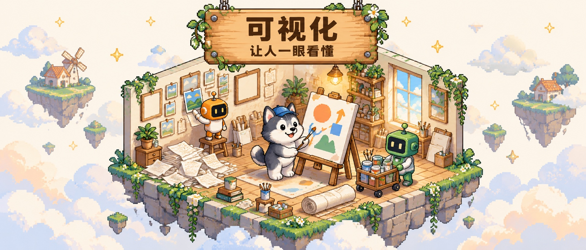
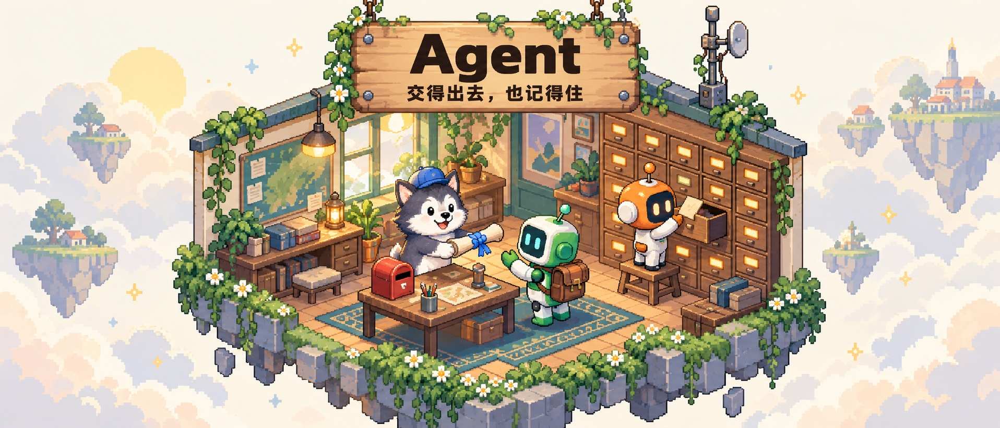

<p align="right"><strong>简体中文</strong> · <a href="./README.en.md">English</a></p>

<p align="center">
  
</p>

<h1 align="center">Yunshu SkillsHub</h1>

<p align="center"><strong>每天和 AI 干活攒下的方法。</strong></p>

<p align="center">
  <a href="https://github.com/yunshu0909/yunshu_skillshub/stargazers"></a>
  <a href="./LICENSE"></a>
  
</p>

<p align="center">
  <a href="#coding">开发</a> ·
  <a href="#thinking">思考</a> ·
  <a href="#learning">学习</a> ·
  <a href="#writing">写作</a> ·
  <a href="#visualization">可视化</a> ·
  <a href="#brand">品牌</a> ·
  <a href="#agent">Agent</a>
</p>

## 这是什么


这是我每天和 AI 一起干活时攒下来的 Skills。

想一个问题、读一篇文章、写一篇稿子、做一个产品，每做完一件事，我就把当时怎么问、怎么判断、做到什么程度算完写下来，下次交给 AI 照着做。所以这里没有凭空设计出来的 skill，每一个都在真实的事情里用过、改过。

## 安装

### 直接跟 Agent 说

把下面这段话发给 Claude Code：

```text
帮我把 https://github.com/yunshu0909/yunshu_skillshub 里的 skills 安装到 Claude Code（用户级，所有项目都能用）。先列出全部 skill 和一句话用途让我挑，再安装我选的；每个 skill 的文件夹要完整保留。装完告诉我装了哪些、装在哪。
```

或者发给 Codex：

```text
帮我把 https://github.com/yunshu0909/yunshu_skillshub 里的 skills 安装到 Codex（用户级，所有项目都能用）。先列出全部 skill 和一句话用途让我挑，再安装我选的；每个 skill 的文件夹要完整保留。装完告诉我装了哪些、装在哪。
```

### 用命令装

```bash
# 先看看有哪些
npx skills add yunshu0909/yunshu_skillshub --list

# 挑几个，同时装到 Claude Code 和 Codex
npx skills add yunshu0909/yunshu_skillshub -g -a claude-code codex --skill thinking-partner writing-assistant

# 全部装上
npx skills add yunshu0909/yunshu_skillshub -g -a claude-code codex --skill '*' -y
```

### 手动装

```bash
git clone https://github.com/yunshu0909/yunshu_skillshub.git

# 装一个：把 skill 文件夹整个复制过去
cp -R yunshu_skillshub/thinking/thinking-partner ~/.claude/skills/   # Claude Code
cp -R yunshu_skillshub/thinking/thinking-partner ~/.agents/skills/   # Codex

# 全部装上（以 Claude Code 为例，Codex 换成 ~/.agents/skills/）
mkdir -p ~/.claude/skills
for f in yunshu_skillshub/*/*/SKILL.md; do cp -R "$(dirname "$f")" ~/.claude/skills/; done
```

装好后直接说你要做什么，或者点名某个 skill。请保留完整的 skill 文件夹，里面的模板、参考材料和脚本也是方法的一部分。

<a id="coding"></a>

## 开发


先把要什么说清楚，再让 AI 动手。从整理需求、定方案、写测试，到改代码、发版本，每一步都能检查。

| Skill | 什么时候用 | 会得到 |
| --- | --- | --- |
| [Issue 池 · `issue-pool`](./coding/issue-pool/SKILL.md) | 零散想法、用户反馈和 bug 要整理 | `ISSUES.md` 和可以开工的问题定义 |
| [页面方案 · `page-solution-design`](./coding/page-solution-design/SKILL.md) | 一个页面要整页重做或从零设计 | 全状态高保真方案和定稿包 |
| [后端逻辑 · `backend-logic-design`](./coding/backend-logic-design/SKILL.md) | 规则复杂，得先讲清楚再写 | 规则表和例子，必要时附交互模拟器 |
| [PRD 与测试用例 · `prd-test-writer`](./coding/prd-test-writer/SKILL.md) | 写需求的同时把测试写好 | 一一对应的 PRD 和测试用例 |
| [双模型协作 · `dual-agent-collaboration`](./coding/dual-agent-collaboration/SKILL.md) | 重要改动想让另一家 AI 审一遍 | 一家写、一家只读审核，修到双方都通过 |
| [需求变更 · `req-change-workflow`](./coding/req-change-workflow/SKILL.md) | 要改一个已经做好的功能 | 影响分析、最小改动和回归清单 |
| [推送与发布 · `git-push`](./coding/git-push/SKILL.md) | 提交、推送或发版 | 发前检查、推送结果，以及 Tag 和 Release |
| [Issue 诊断 · `issue-triage`](./coding/issue-triage/SKILL.md) | 开源项目收到了 Issue | 根因判断、处理建议和回复稿 |
| [开源项目搜索 · `github-repo-search`](./coding/github-repo-search/SKILL.md) | 想找可以借鉴的开源项目 | 带比较的推荐清单 |

> `dual-agent-collaboration` 需要本机装好 Codex 和 Claude Code；`git-push` 发版需要登录 `gh`。

<a id="thinking"></a>

## 思考


很多时候不是不会做，是还没想清楚。陪你理清问题、换个角度看、做出取舍。

| Skill | 什么时候用 | 会得到 |
| --- | --- | --- |
| [思考拍档 · `thinking-partner`](./thinking/thinking-partner/SKILL.md) | 局面很乱，说不清卡在哪 | 问题诊断、几种解法和下一步 |
| [多视角分析 · `multi-perspective-analysis`](./thinking/multi-perspective-analysis/SKILL.md) | 怕自己被一种思路框住 | 多个独立视角的推演，共识、分歧和盲区 |
| [最重要的三件事 · `find-top-three`](./thinking/find-top-three/SKILL.md) | 人生、职业或业务方向上要做取舍 | 当前阶段最重要的三件事，和可以马上做的下一步 |

<a id="learning"></a>

## 学习


读完和学会之间，还隔着复述、测验和用起来。具体材料就精读，陌生领域就先搭出整体地图。

| Skill | 什么时候用 | 会得到 |
| --- | --- | --- |
| [文章精读 · `article-study`](./learning/article-study/SKILL.md) | 有一篇文章、文档或代码想真正读懂 | 分讲课件、随堂测验和错题回顾 |
| [系统化学习 · `system-study`](./learning/system-study/SKILL.md) | 想系统了解一个陌生领域 | 带来源、案例和争议的知识地图 |

<a id="writing"></a>

## 写作


文章从自己的想法里长出来。观点清楚就直接搭框架写；观点还散，就先把它挖出来。

| Skill | 什么时候用 | 会得到 |
| --- | --- | --- |
| [写作助手 · `writing-assistant`](./writing/writing-assistant/SKILL.md) | 想写一篇，从选题一路到成稿 | 选题、框架和完整初稿 |
| [思维挖掘 · `thought-mining`](./writing/thought-mining/SKILL.md) | 有很多零碎想法，说不出核心观点 | 挖出来的观点、候选选题和写作素材 |

<a id="visualization"></a>

## 可视化



让别人一眼看懂：看案例知道别人做出了什么，看配图抓住一个意思，看长文能顺着读完。

| Skill | 什么时候用 | 会得到 |
| --- | --- | --- |
| [案例雷达 · `case-radar`](./visualization/case-radar/SKILL.md) | 想看看一个新领域里别人真做出了什么 | 带截图和来源的案例集 |
| [配图助手 · `image-assistant`](./visualization/image-assistant/SKILL.md) | 文章或讲解要配图 | 每张图讲什么、图上写什么，以及生图提示词 |
| [可读长文 · `readable-output`](./visualization/readable-output/SKILL.md) | 想把资料、复盘或教程写成给人读的 | 结构清楚的 HTML 长文 |

<a id="brand"></a>

## 品牌


名字和 Logo 回答的是同一件事：这个产品是谁、给谁用、想留下什么印象。

| Skill | 什么时候用 | 会得到 |
| --- | --- | --- |
| [产品命名 · `product-naming`](./brand/product-naming/SKILL.md) | 给产品、项目或模块起名 | 命名方向、候选名和取舍理由 |
| [Logo 设计 · `logo-design`](./brand/logo-design/SKILL.md) | 从定位一路做到能用的 Logo 和图标 | 方向对比、精修稿和应用图标 |

> `logo-design` 出图和改图需要 Codex。

<a id="agent"></a>

## Agent



把任务交给 Agent，光说一句“去做”不够，它还要知道目标、记得上下文。

| Skill | 什么时候用 | 会得到 |
| --- | --- | --- |
| [目标契约 · `goal-setter`](./agent/goal-setter/SKILL.md) | 要把任务交给另一个 Agent 自己跑 | 写清范围、完成标准和停止条件的 goal |
| [项目记忆 · `memory-init`](./agent/memory-init/SKILL.md) | 新项目，不想每次重讲一遍背景 | `CLAUDE.md`、`MEMORY.md` 和 `memory/` |
| [陪伴型人设 · `hermes-persona-builder`](./agent/hermes-persona-builder/SKILL.md) | 给 Hermes 或陪伴型 Agent 定人设 | 可以直接用的 `SOUL.md` |
| [文件夹整理 · `organize`](./agent/organize/SKILL.md) | 文件堆得乱，命名也乱 | 分类方案和整理好的目录 |

## 认识一下

想认识我、聊聊怎么用 AI 干活，欢迎加我微信。

<p align="center"></p>

用的时候遇到问题，也欢迎直接提 [Issue](https://github.com/yunshu0909/yunshu_skillshub/issues)。更新记录见 [CHANGELOG](./CHANGELOG.md)。

---

<p align="center">采用 <a href="./LICENSE">MIT License</a> · Made with care by 云舒</p>
