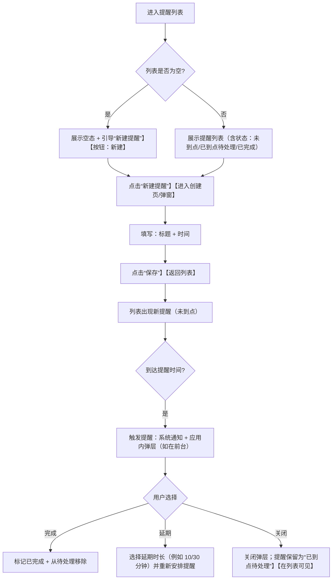
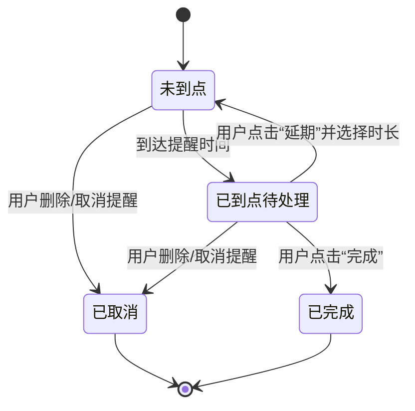
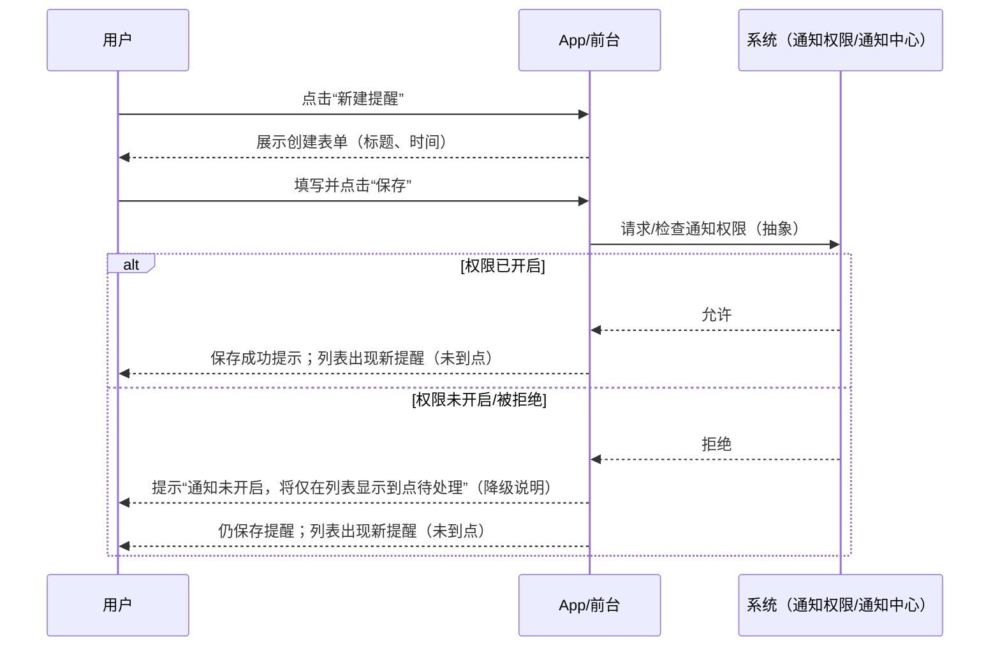
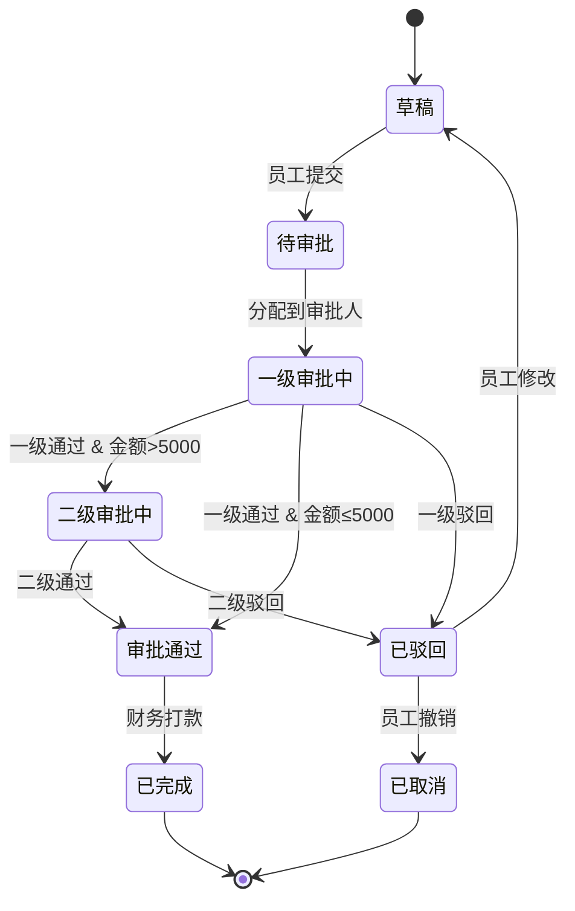
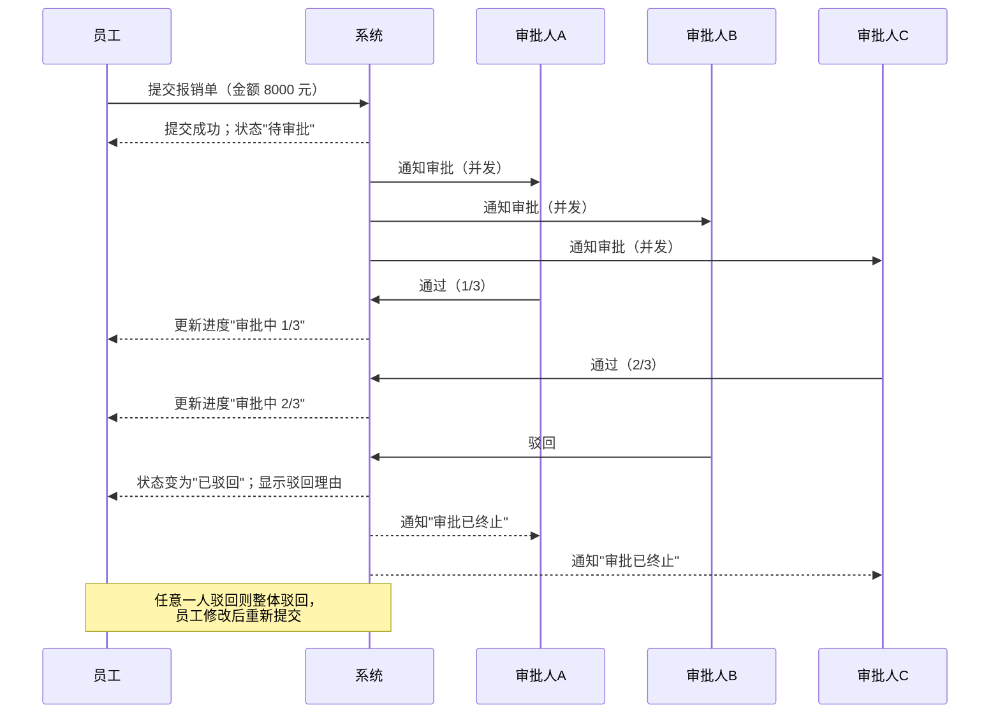

# Mermaid 图示例（需求侧）

> 用途：用图把"流程/状态/关键交互"讲清楚，减少歧义。
> 约束：尽量保持在需求层（用户可见行为与系统表现），不要写 API 路径、字段、HTTP code、框架/库。
> **复杂度控制**：单张图建议不超过 15-20 个节点。对于复杂流程，优先"分阶段绘制多张图"而不是一张巨大的图。

## 示例 1：用户操作流（Flowchart）

场景：手机端「一次性提醒」从列表到创建、触发、处理的闭环。



## 示例 2：状态机（State Diagram）

场景：单个提醒的状态流转（“用户看得见/验收得了”的状态）。



## 示例 3：关键场景时序（Sequence）

场景：创建提醒时的“权限提示/降级路径”（强调用户可见结果，不落到实现）。



---

## 示例 4：B 端后台审批流（Flowchart）

场景：企业内部「报销审批」从提交到审批完成的完整流程（包含驳回重来）。

```mermaid
flowchart TD
  A[员工进入报销页面] --> B[填写报销信息：金额 + 类型 + 附件]
  B --> C[点击"提交审批"]
  C --> D[系统校验]

  D --> E{校验通过?}
  E -->|否| F[展示错误提示（如"附件缺失"）]
  F --> B

  E -->|是| G[提交成功；状态变为"待审批"]
  G --> H[通知审批人（系统通知/邮件）]

  H --> I{一级审批人操作}
  I -->|通过| J{金额是否 > 5000?}
  I -->|驳回| K[状态变为"已驳回"；通知员工并显示驳回理由]
  K --> L[员工修改后重新提交]
  L --> D

  J -->|否| M[状态变为"审批通过"；通知员工]
  J -->|是| N[流转到二级审批人；状态变为"二级审批中"]

  N --> O{二级审批人操作}
  O -->|通过| M
  O -->|驳回| K

  M --> P[财务打款；状态变为"已完成"]
  P --> Q[结束]
```

## 示例 5：B 端报销单状态机（State Diagram）

场景：单个报销单在系统中的状态流转（用户和审批人可见的状态）。



## 示例 6：B 端并发审批时序（Sequence）

场景：当审批需要"多人会签"（所有人都通过才算通过）时的并发处理逻辑。



